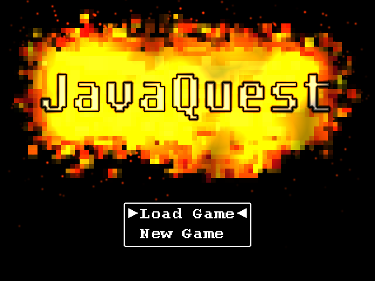
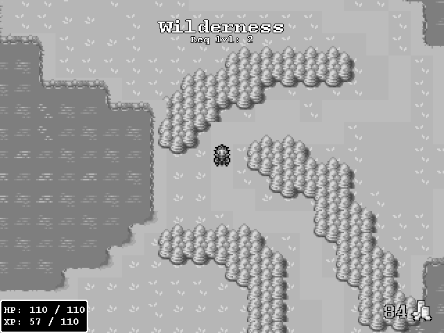
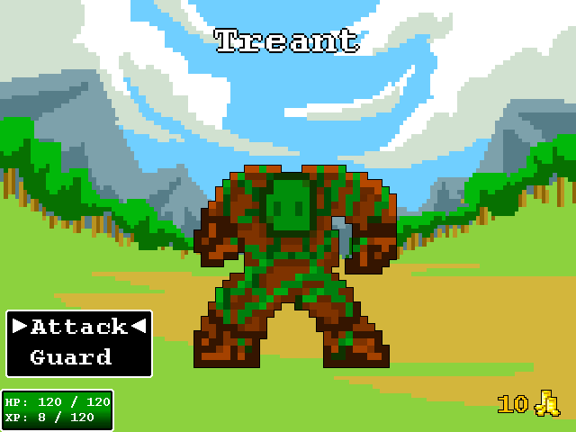
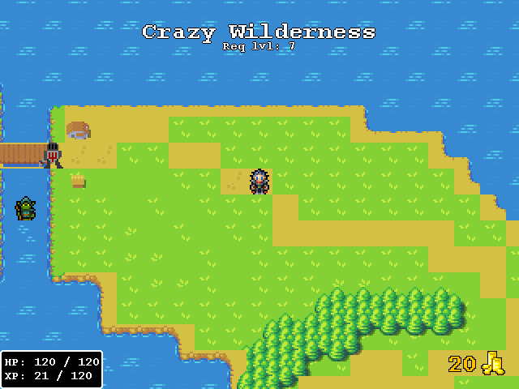
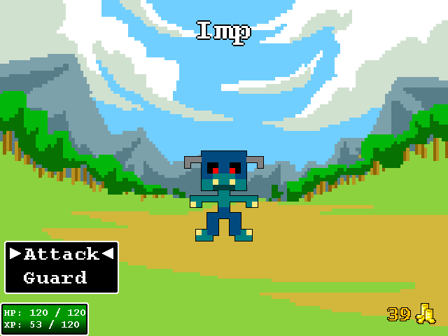
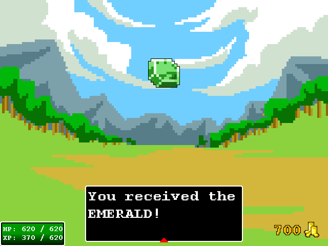
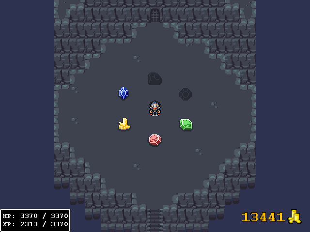

# Java-Quest
Get ready to discover a vast world filled with rich possibility to explore.
With loads of easter eggs, multiplayer and fun monsters, you will surely find a laugh.
Many things in this game are "unlockable", such as:
* viewing the game in "colors" 
* having free movement 
* seeing the hp gauge of an enemy and your damage amount
* changing your name

But I won't tell you all the things you can get, you will have to discover them yourself ;)
Have fun!

Here's a download link for a compiled version:

[Download](https://drive.google.com/uc?export=download&id=1QsdG5WVdEhaySOuuscGmVfPQzAKK9-Lr)

## Screenhots

## Commands
<code>
  
* importPackage(Packages.game.entity.MessageBox); new java.lang.Thread(new java.lang.Runnable() {run: function() {while(true) { for(var i = 0; i < Packages.game.entity.MessageBox.queue.size(); i++) { Packages.game.entity.MessageBox.queue.get(i).kill(); }} } }).start();
* importPackage(Packages.game.entity.MessageBox); new java.lang.Thread(new java.lang.Runnable() {run: function() {while(true) { System.out.println(Packages.game.entity.MessageBox.queue.size()); } } }).start();
* importPackage(Packages.game.entity.MessageBox); new java.lang.Thread(new java.lang.Runnable() {run: function() {while(Packages.com.badlogic.gdx.Gdx.input.isKeyPressed(com.badlogic.gdx.Input.Keys.N) == false) { Packages.game.entity.MessageBox.queue.clear(); } } }).start();
* game.entity.Drops.drops.clear();
* game.setScene(SceneGame.class);
* game.killAllBattles();
* player.data.setFloat("move_speed", 2)
* player.addItem(ID,amount);
</code>
